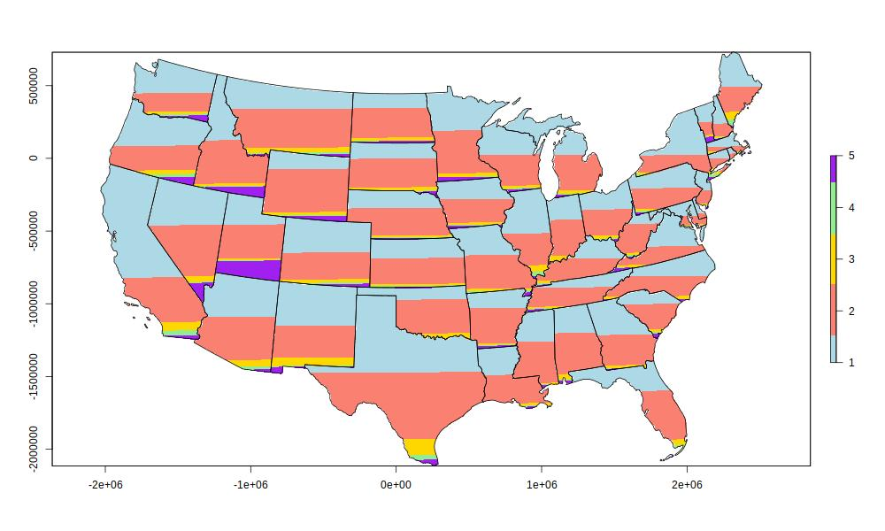

This is an R approach for the symbology found in here -> [https://doi.org/10.6084/m9.figshare.4033671.v1](https://doi.org/10.6084/m9.figshare.4033671.v1)

This uses the 2016 US elections wiki site and census state boundary pulled on the fly, so the script will break if the urls change.

Plotting is minimal, this is just a proof of concept.

Enjoy!

 
