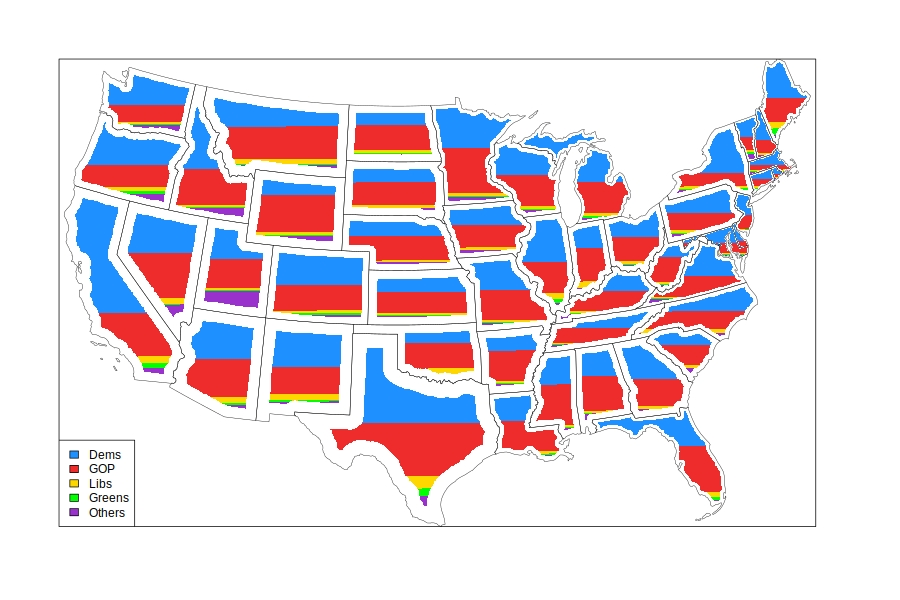

This is an R approach for the symbology found in here -> [https://doi.org/10.6084/m9.figshare.4033671.v1](https://doi.org/10.6084/m9.figshare.4033671.v1)

This uses the 2016 US elections wiki site, census state boundaries, and turnout data. 

See `xGetBaseData.R` for data processing steps.

See `rasterFill.R` for the visualization and export.

Enjoy!

 
